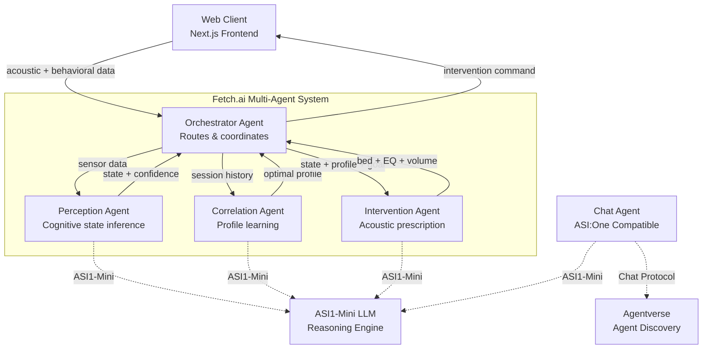

# Residue — Personalized Acoustic Intelligence


**AI that learns your optimal acoustic environment and actively shapes it for peak cognitive performance.**

Residue runs passively in the background, sampling your acoustic environment through your microphone while tracking behavioral proxies for your cognitive state. Over time, it builds a personal acoustic-to-state model, learning what specific sound environments make *you* most productive. Once the model is built, Residue actively shapes your acoustic environment — adding, subtracting, and filtering frequencies in real time to push your environment toward your optimal profile.

## What Makes Residue Novel

This is the **first consumer application of personalized acoustic biofeedback**. The research exists — acoustic environments measurably affect cognitive performance — but it has never been operationalized as a personal, learning, on-device AI system. Brain.fm is a content library. **Residue is a closed-loop system that learns and adapts to you specifically.**

## Multi-Agent Architecture (Fetch.ai uAgents + ASI1-Mini)

Residue uses a **four-agent system** built on the [Fetch.ai uAgents framework](https://github.com/fetchai/uAgents) with [ASI1-Mini](https://asi1.ai) as the reasoning engine:



### Agent Descriptions

| Agent | Role | Technology | Runs On |
|-------|------|-----------|---------|
| **PerceptionAgent** | Infers cognitive state (focused/distracted/idle/transitioning) from acoustic + behavioral telemetry | uAgents + ASI1-Mini reasoning | Python service |
| **CorrelationAgent** | Builds personal acoustic-to-state model, generates profile insights | uAgents + ASI1-Mini + MongoDB | Python service |
| **InterventionAgent** | Computes optimal acoustic intervention (bed selection, EQ, volume) | uAgents + ASI1-Mini reasoning | Python service |
| **OrchestratorAgent** | Coordinates the perception→correlation→intervention pipeline | uAgents + HTTP API | Python service |
| **Chat Agent** | ASI:One compatible agent for Agentverse discovery | uAgents Chat Protocol + ASI1-Mini | Python service |

### ASI1-Mini Integration

Each agent uses [ASI1-Mini](https://asi1.ai) for intelligent reasoning:

- **Perception**: Analyzes acoustic frequency bands + behavioral signals to infer cognitive state with natural language explanation (not just rule-based)
- **Correlation**: Generates human-readable insights about why certain acoustic environments work for you
- **Intervention**: Reasons about which ambient soundscape best matches your goal + current state + learned profile
- **Chat Agent**: Domain-expert conversational interface for acoustic intelligence questions

### Behavioral Data Shape (`window.__residueBehavior`)

Published at 10Hz for inter-agent consumption:
```typescript
{
  typingSpeed: number;       // WPM, rolling 30s window
  errorRate: number;         // backspaces/min
  interKeyLatency: number;   // mean ms between keystrokes
  mouseJitter: number;       // deviation from smoothed path (px)
  scrollVelocity: number;    // px/s, rolling average
  focusSwitchRate: number;   // window focus switches/min
  timestamp: number;
}
```

## Features

### Acoustic Environment Analysis
- Real-time FFT frequency analysis via Web Audio API
- dB level monitoring with optimal zone detection
- 7-band frequency breakdown (Sub-bass through Brilliance)
- Spectral centroid and dominant frequency tracking
- All processing happens **on-device** — no audio data leaves your machine

### Behavioral Signal Capture
- **Keystroke dynamics**: inter-key latency, hold duration, error rate, rolling WPM
- **Mouse trajectory**: jitter at 30Hz, scroll velocity, idle time
- **Window focus**: app-switch rate via Visibility API
- Privacy: **only timing data captured, never keystroke content**

### Personalized Acoustic Profile (Bayesian)
- Conjugate Gaussian posterior updates with confidence intervals
- Confounder tracking: time of day, day of week, task type
- UI shows "We are 65% confident your optimal dB range is 45-58, based on 12 sessions"

### Acoustic Overlay Engine
- 6 synthesized soundscapes: Brown Noise, Pink Noise, White Noise, Rain, Cafe, Binaural Beats
- ElevenLabs Sound Effects API for generative ambient beds
- Prompt template system: profile → natural language → synthesized audio
- Cosine-distance caching (regenerate only when profile changes > 0.15)

### Study Buddy Matching
- Cosine similarity over 7-dim EQ vectors
- Location-aware filtering (Haversine distance)
- Powered by Fetch.ai multi-agent system

## Tech Stack

| Component | Technology | Purpose |
|-----------|-----------|---------|
| Frontend | Next.js 16 + React 19 + Tailwind CSS | Web application |
| Audio Analysis | Web Audio API (on-device FFT) | Real-time acoustic profiling |
| Screen Tracking | Screen Capture API + Canvas diffing | Productivity inference |
| LLM Reasoning | **ASI1-Mini** (Fetch.ai) | Agent reasoning & cognitive inference |
| Agent System | **Fetch.ai uAgents** + Chat Protocol | Multi-agent coordination & Agentverse |
| Data Store | MongoDB Atlas (time-series + vector search) | Longitudinal acoustic-state data |
| Audio Generation | Web Audio API + ElevenLabs SFX API | Personalized soundscapes |
| On-Device ML | ZETIC Melange | Privacy-preserving inference |

## Track Alignment

- **Fetch.ai** ($2,500) — Multi-agent system with ASI1-Mini reasoning, uAgents framework, Chat Protocol, Agentverse registration
- **Cognition** ($3,000) — Agents with acoustic environment awareness as a first-class context type
- **ElevenLabs** (earbuds) — Generative ambient beds from learned frequency profiles
- **ZETIC** ($1,000) — All acoustic analysis + behavioral inference runs entirely on-device
- **MongoDB** (M5Stack) — Time-series collections + Atlas Vector Search for acoustic embeddings

## Getting Started

### Web Application (Next.js)

```bash
# Install dependencies
npm install

# Copy environment template
cp .env.local.example .env
# Fill in your API keys in .env

# Run development server
npm run dev
```

Open [http://localhost:3000](http://localhost:3000).

### Agent System (Fetch.ai uAgents)

```bash
# Install Python dependencies
cd scripts
pip install -r requirements.txt

# Run all agents (Perception, Correlation, Intervention, Orchestrator)
python agents/run_all.py

# Or run the ASI:One Chat Agent for Agentverse
python agents/residue_chat_agent.py
```

The orchestrator exposes an HTTP API on port 8765:
- `POST /orchestrate` — Full perception → correlation → intervention pipeline
- `POST /perceive` — Perception only (cognitive state inference)
- `POST /correlate` — Correlation only (profile building)
- `POST /intervene` — Intervention only (acoustic prescription)
- `GET /health` — Agent system status

### Agentverse Registration

1. Run the chat agent: `python scripts/agents/residue_chat_agent.py`
2. Go to [agentverse.ai](https://agentverse.ai) and sign in
3. Create a mailbox for the agent (it auto-connects)
4. The agent is now discoverable via ASI:One

## Architecture

```
┌─────────────────────────────────────────────────┐
│  Browser (All On-Device)                         │
│  ┌─────────────┐  ┌───────────────────────────┐ │
│  │ Mic Capture  │  │ Screen Capture + Diff     │ │
│  │ (Web Audio)  │  │ (Canvas API, on-device)   │ │
│  └──────┬──────┘  └──────────┬────────────────┘ │
│         │                    │                   │
│  ┌──────▼──────┐  ┌─────────▼────────────────┐ │
│  │ FFT Analyzer│  │ Behavioral Tracker       │ │
│  │ (7-band EQ) │  │ (keystrokes, mouse, focus)│ │
│  └──────┬──────┘  └──────────┬───────────────┘ │
│         └────────┬───────────┘                   │
│          ┌───────▼────────┐                     │
│          │ Agent System   │                     │
│          │ (4 uAgents +   │                     │
│          │  ASI1-Mini)    │                     │
│          └───────┬────────┘                     │
│          ┌───────▼────────┐                     │
│          │ Audio Overlay  │                     │
│          │ (Web Audio +   │                     │
│          │  ElevenLabs)   │                     │
│          └────────────────┘                     │
└─────────────────────────────────────────────────┘
         │              │              │
    ┌────▼────┐   ┌─────▼──────┐ ┌────▼─────┐
    │MongoDB  │   │Fetch.ai    │ │ASI1-Mini │
    │Atlas    │   │Agentverse  │ │LLM       │
    └─────────┘   └────────────┘ └──────────┘
```

## Privacy

**All audio and screen data is processed entirely on-device.** No microphone audio, screen captures, or productivity data ever leaves your machine. Only aggregated, anonymized acoustic profiles are stored in MongoDB Atlas for longitudinal analysis. Keystroke content is never captured — only timing metrics. This is a core architectural principle, not a feature toggle.

## Sponsor Integration Depth

| Sponsor | Integration | Depth |
|---------|------------|-------|
| **Fetch.ai** | uAgents framework, ASI1-Mini LLM, Chat Protocol, Agentverse registration, multi-agent orchestration | Deep — 5 real agents with typed messages and LLM reasoning |
| **Cognition** | Acoustic environment as first-class agent context, perception→action loop | Deep — novel agent context type |
| **ElevenLabs** | Sound Effects API, prompt template from profiles, cosine-distance caching | Medium — generative pipeline with smart caching |
| **ZETIC** | On-device FFT, behavioral inference, privacy-first architecture | Medium — architecture ready, placeholder for Melange SDK |
| **MongoDB** | Time-series collections, Atlas Vector Search, profile CRUD, bed caching | Deep — time-series + vector search + GridFS |

## License

MIT
